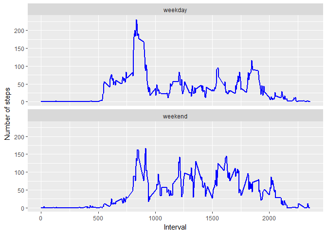

## Loading and preprocessing the data

```r
#load libraries
library(ggplot2)
```

```
## Warning: package 'ggplot2' was built under R version 3.4.4
```

```r
library(chron)
```

```
## Warning: package 'chron' was built under R version 3.4.4
```

```r
#Loading data into R
myData <- read.csv("activity.csv")

#Format date column as date and change the format to MM/DD/YYYY
myData$date <- format(as.Date(myData$date),"%m/%d/%Y")

#remove missing values from the myData
myData1 <- na.omit(myData)
```


## What is mean total number of steps taken per day?

```r
#Calculates the total number of steps taken per day
totalSteps <-aggregate(steps~date, myData1, sum)
knitr::kable(totalSteps[1:10,],align="l", format="markdown")
```


|date       |steps |
|:----------|:-----|
|10/02/2012 |126   |
|10/03/2012 |11352 |
|10/04/2012 |12116 |
|10/05/2012 |13294 |
|10/06/2012 |15420 |
|10/07/2012 |11015 |
|10/09/2012 |12811 |
|10/10/2012 |9900  |
|10/11/2012 |10304 |
|10/12/2012 |17382 |

```r
#Creates a histogram from the totalSteps calculation
hist(totalSteps$steps, breaks = c(0,2500,5000,7500,10000,12500,15000,17500,20000,22500,25000), ylim=c(0,35), xlab="Steps", ylab="Days", col = "light green", main="Total Number of Steps Taken Per Day")
```

<!-- -->

```r
#Calculates the mean of the total number of steps taken per day
totalMean <- mean(totalSteps$steps)
cat("The mean of the total number of steps taken per day is:", totalMean)
```

```
## The mean of the total number of steps taken per day is: 10766.19
```

```r
#Calculates the median of the total number of steps taken per day
totalMedian <- median(totalSteps$steps)
cat("The median of the total number of steps taken per day is:", totalMedian)
```

```
## The median of the total number of steps taken per day is: 10765
```

## What is the average daily activity pattern?

```r
#calculate the mean of steps~interval
meanInterval <- aggregate(steps~interval, myData1, mean)

knitr::kable(meanInterval[1:10,],align="l", format="markdown")
```


|interval |steps     |
|:--------|:---------|
|0        |1.7169811 |
|5        |0.3396226 |
|10       |0.1320755 |
|15       |0.1509434 |
|20       |0.0754717 |
|25       |2.0943396 |
|30       |0.5283019 |
|35       |0.8679245 |
|40       |0.0000000 |
|45       |1.4716981 |

```r
#time series plot with the average number of steps taken, averged accross all days by 5-minute interval
plot(meanInterval$interval,meanInterval$steps, type = "l", main ="5-Minute Interval and the Average Number of Steps Per Day",xlab = "5-Minute Interval", ylab="Steps")
```

<!-- -->

```r
#Interval with the maximum number of steps
paste("Interval with max value =",meanInterval$interval[which(meanInterval$steps ==max(meanInterval$steps))])
```

```
## [1] "Interval with max value = 835"
```

```r
paste("Steps of max interval is =",max(meanInterval$steps))
```

```
## [1] "Steps of max interval is = 206.169811320755"
```

## Imputing missing values

```r
totalNA <-sum(is.na(myData))
cat("Total number of missing valus is:", totalNA)
```

```
## Total number of missing valus is: 2304
```

```r
#New dataset with missing data filled in

#Mean steps per interval
totalStep2 <- aggregate(steps~interval, myData1, mean)
knitr::kable(totalStep2[1:10,],align="l", format="markdown")
```


|interval |steps     |
|:--------|:---------|
|0        |1.7169811 |
|5        |0.3396226 |
|10       |0.1320755 |
|15       |0.1509434 |
|20       |0.0754717 |
|25       |2.0943396 |
|30       |0.5283019 |
|35       |0.8679245 |
|40       |0.0000000 |
|45       |1.4716981 |

```r
#merge data with mean only fill in values where values are NA
myData2 <- merge(x=myData, y=totalStep2, by="interval")
myData2$steps.x <- ifelse(is.na(myData2$steps.x), myData2$steps.y,myData2$steps.x)
myData3<-myData2[,c("steps.x", "date", "interval"),]
knitr::kable(myData3[1:10,],align="l", format="markdown")
```


|steps.x  |date       |interval |
|:--------|:----------|:--------|
|1.716981 |10/01/2012 |0        |
|0.000000 |11/23/2012 |0        |
|0.000000 |10/28/2012 |0        |
|0.000000 |11/06/2012 |0        |
|0.000000 |11/24/2012 |0        |
|0.000000 |11/15/2012 |0        |
|0.000000 |10/20/2012 |0        |
|0.000000 |11/16/2012 |0        |
|0.000000 |11/07/2012 |0        |
|0.000000 |11/25/2012 |0        |

```r
#total number of steps for each day with new dataset
totalSteps3 <-aggregate(steps.x~date, myData3, sum)
knitr::kable(totalSteps3[1:10,],align="l", format="markdown")
```


|date       |steps.x  |
|:----------|:--------|
|10/01/2012 |10766.19 |
|10/02/2012 |126.00   |
|10/03/2012 |11352.00 |
|10/04/2012 |12116.00 |
|10/05/2012 |13294.00 |
|10/06/2012 |15420.00 |
|10/07/2012 |11015.00 |
|10/08/2012 |10766.19 |
|10/09/2012 |12811.00 |
|10/10/2012 |9900.00  |

```r
#histogram for total number of steps taken each day with new dataset
hist(totalSteps3$steps.x, breaks = c(0,2500,5000,7500,10000,12500,15000,17500,20000,22500,25000), ylim=c(0,35), xlab="Steps", ylab="Days", col = "light green", main="Total Number of Steps Taken Per Day - With NAs Values Filled In")
```

<!-- -->

```r
#Calculates the mean of the total number of steps taken per day with new dataset
totalMean2 <- mean(totalSteps3$steps.x)
cat("Mean of the total number of steps per day with new dataset is:", totalMean2)
```

```
## Mean of the total number of steps per day with new dataset is: 10766.19
```

```r
#Calculates the median of the total number of steps taken per day with new dataset
totalMedian2 <- median(totalSteps3$steps.x)
cat("Median of the total number of steps per day with new dataset is:", totalMedian2)
```

```
## Median of the total number of steps per day with new dataset is: 10766.19
```

```r
#showing a comparision between removing NAs histogram and adding in missing values histogram

#Creates a histogram from the totalSteps calculation
hist(totalSteps$steps, breaks = c(0,2500,5000,7500,10000,12500,15000,17500,20000,22500,25000), ylim=c(0,35), xlab="Steps", ylab="Days", col = "light green", main="Total Number of Steps Taken Per Day")
```

<!-- -->

```r
hist(totalSteps3$steps.x, breaks = c(0,2500,5000,7500,10000,12500,15000,17500,20000,22500,25000), ylim=c(0,35), xlab="Steps", ylab="Days", col = "light green", main="Total Number of Steps Taken Per Day - With NAs Values Filled In")
```

<!-- -->

####1.Do these values differ from the estimates from the first part of the assignment?

####2.What is the impact of imputting missing data on the estimates of the total daily number of steps?

#####The mean values remained the same, however the median value with NAs increased by 1.19. This is not a significant increase, therefore excluding NAs did not skew the data.


## Are there differences in activity patterns between weekdays and weekends?

```r
#Creates a factor variable with two levels - "weekday" and "weekend"
totalWeekdays <-table(is.weekend(myData3$date))
cat("Total weekdays/weekends - First value weekdays, second value weekends:",totalWeekdays)
```

```
## Total weekdays/weekends - First value weekdays, second value weekends: 12960 4608
```

```r
myData3$daysofweek <- ifelse(is.weekend(myData3$date), "weekend", "weekday")
knitr::kable(myData3[1:10,],align="l", format="markdown")
```


|steps.x  |date       |interval |daysofweek |
|:--------|:----------|:--------|:----------|
|1.716981 |10/01/2012 |0        |weekday    |
|0.000000 |11/23/2012 |0        |weekday    |
|0.000000 |10/28/2012 |0        |weekend    |
|0.000000 |11/06/2012 |0        |weekday    |
|0.000000 |11/24/2012 |0        |weekend    |
|0.000000 |11/15/2012 |0        |weekday    |
|0.000000 |10/20/2012 |0        |weekend    |
|0.000000 |11/16/2012 |0        |weekday    |
|0.000000 |11/07/2012 |0        |weekday    |
|0.000000 |11/25/2012 |0        |weekend    |

```r
#Calculates the mean of the interval and day of the week
meanInterval2<-aggregate(steps.x~interval + daysofweek, myData3, mean)
knitr::kable(meanInterval2[1:10,],align="l", format="markdown")
```


|interval |daysofweek |steps.x   |
|:--------|:----------|:---------|
|0        |weekday    |2.2511530 |
|5        |weekday    |0.4452830 |
|10       |weekday    |0.1731656 |
|15       |weekday    |0.1979036 |
|20       |weekday    |0.0989518 |
|25       |weekday    |1.5903564 |
|30       |weekday    |0.6926625 |
|35       |weekday    |1.1379455 |
|40       |weekday    |0.0000000 |
|45       |weekday    |1.7962264 |

```r
#Time series plot of the 5-Minute interval and the average number of steps teken, averaged across all weekday or weekend days

myData4<-ggplot(meanInterval2, aes(x=interval, y=steps.x))+
	geom_line(color="blue", size=1)+
	facet_wrap(~daysofweek, nrow=2)+
	labs(x="Interval", y="Number of steps")

print(myData4)
```

<!-- -->
